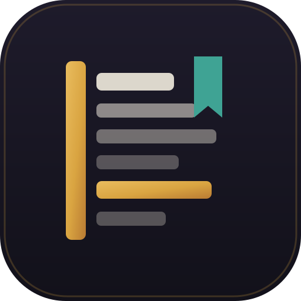

<p align="center">
  
</p>

<h1 align="center">KODEX</h1>

<p align="center">
  <b>Persönliche Notiz- und Wissens-App mit Block-Editor, relationalen Datenbanken, echter Ende-zu-Ende-Verschlüsselung und blockweiser Echtzeit-Synchronisation. Vollständig clientseitig, offlinefähig und in einer einzigen Datei.</b>
</p>

<p align="center">
  
  
  
  
  
</p>

---

## 📖 Über KODEX

**KODEX** ist eine eigenständige Alternative zu Notion und Obsidian. Sie wurde mit kompromisslosem Fokus auf **Datensouveränität (Local-First)**, Geschwindigkeit und Privatsphäre gebaut:

* 🔒 **100 % Client-Side & Zero-Knowledge**: Deine Daten liegen bei dir. Es gibt keine Pflicht-Accounts, kein Tracking und keine Server, die deine Notizen im Klartext sehen können.
* 📦 **Single-File-Architektur**: Die gesamte Applikation (Kern, Benutzeroberfläche, Stile und Krypto-Logik) läuft in einer einzigen HTML-Datei – überall per Doppelklick und komplett ohne Internetverbindung lauffähig.
* 📱 **Progressive Web App (PWA)**: Lässt sich nativ als App auf Mobilgeräten (iOS, Android) und dem Desktop (Linux, macOS, Windows) installieren.

---

## ✨ Funktionen im Überblick

### 🧱 Block-Editor
* **Echte Block-Isolierung**: Jeder Block nutzt sein eigenes `contenteditable`-Feld. Das verhindert Cursor-Sprünge und unkontrollierte DOM-Verschachtelungen.
* **Umfangreiche Blocktypen**: Absätze, Überschriften (H1–H3), To-dos mit Checkboxen, Aufzählungen, nummerierte Listen, Callouts mit Symbolwähler, Klappblöcke (Toggle), Zitate, Codeblöcke mit Sprachauswahl, Trenner, Lesezeichen und Bilder.
* **Tastatur-Fokus**:
  * Markdown-Kürzel (`#`, `##`, `-`, `1.`, `[]`, `>`, `---`, ```` `)
  * `/` öffnet den schnellen Blockwähler
  * `[[Seitenname]]` erzeugt Verknüpfungen mit automatischer Rückverweiserkennung (Backlinks)
* **Mobile-First Touch-Dock**: Bei Touch-Bedienung dockt eine feste Werkzeugleiste oberhalb der Bildschirmtastatur an. So kollidieren Textwerkzeuge nie mit dem System-Menü von iOS oder Android.
* **Zeichengenaue Formatierung**: Schriftart und Schriftgröße lassen sich für markierten Text bis auf den einzelnen Buchstaben genau anpassen.

### 🗄️ Relationale Datenbanken
* **5 Ansichten auf denselben Datenbestand**: Tabelle, Kanban-Board, Kalender, Liste und Galerie.
* **Typisierte Spalten**: Titel, Status, Auswahl, Mehrfachauswahl, Datum, Zahl, Kontrollkästchen, URL und Formel.
* **Eigener AST-Formelrechner**: Formeln wie `if(prop("Status") == "Fertig", 100, round(prop("Fortschritt") * 100))` werden durch einen sicheren Rechenkern ausgewertet – ohne unsicheres `eval()`.
* **Filter, Sortierung & Gruppierung**: Regelbasierte Filterketten, Mehrfachsortierungen und Spaltengruppierungen.

### 🎨 Papiertöne & Dokument-Modus
* **10 Pastell-Papiertöne** (u. a. Rosé, Pfirsich, Sand, Minze, Salbei, Taube) mit kontinuierlicher Kontrastabstimmung im Hell- und Dunkelmodus über `OKLab`.
* **6 Hintergrundraster**: Liniert, Kariert, Punkte, Millimeterpapier, Feines Karo und Schulheftrand.
* **Dokument-Darstellung**: Schaltet jede Notiz per Klick in ein druckfertiges Layout mit automatischer Kapitelnummerierung (`01`, `02`, ...) und Vorspann um.

---

## 🔐 Krypto-Design & Sicherheitsmodell

KODEX setzt auf Hardware-beschleunigte Verschlüsselung direkt im Browser über die standardisierte **Web Crypto API**:

```
           Passwort des Nutzers
                    │
                    ▼
     [ Zufälliger Salt (16 Bytes via CSPRNG) ]
                    │
                    ▼
     [ PBKDF2 (SHA-256, 150.000 Runden) ]
                    │
                    ▼
     [ AES-GCM Schlüssel (256-Bit) ]
                    │
    ┌───────────────┴───────────────┐
    ▼                               ▼
[ Initialisierungsvektor ]   [ Verschlüsselung & Auth-Tag ]
  (12 Bytes CSPRNG pro Save)     (Verhindert unbemerkte Manipulation)
    │                               │
    └───────────────┬───────────────┘
                    ▼
           Chiffrat (Base64)
```

1. **Schlüsselableitung (KDF)**: Aus dem Passwort wird mittels **PBKDF2** (SHA-256) über **150.000 Runden** und einem kryptographisch sicheren 16-Byte-Salt ein 256-Bit-Schlüssel berechnet.
2. **Verschlüsselungsverfahren**: **AES-256-GCM** garantiert Vertraulichkeit und Integrität. Manipulationen an den gespeicherten Daten führen automatisch zum Abbruch statt zu Datenmüll.
3. **Zwei Schutzebenen**:
   * **Einzelne Seiten**: Verschlüsselt nur den Blockbaum und die Datenbank einer bestimmten Seite. Die Seitenstruktur im Baum bleibt als Orientierung sichtbar.
   * **Ganzer Arbeitsbereich**: Versiegelt den gesamten Zustand. Beim Laden der Datei erscheint ein Sperrbildschirm; ohne Passwort sind weder Seitennamen noch Notizinhalte einsehbar.

---

## 🔄 Synchronisation & Zusammenarbeit

KODEX benötigt keine relationale Datenbank auf Serverseite. Der Datenabgleich funktioniert in mehreren Stufen:

```
┌─────────────────────────────────────────────────────────────┐
│                        KODEX App                            │
└──────────────┬───────────────────────────────┬──────────────┘
               │                               │
      (Lokales System)                 (Echtzeit-Netzwerk)
               │                               │
   ┌───────────┴───────────┐                   │
   ▼                       ▼                   ▼
BroadcastChannel       localStorage     WebSocket-Relais
(Mehrere Tabs/Fenster) (Fallback-Bus)   (~20 Zeilen Node.js)
```

* **Zusammenführung auf Blockebene**: Änderungen werden nicht grob dateiweise überschrieben, sondern pro Block anhand von Revisionsnummer und Zeitstempel (`Last-Write-Wins`) zusammengeführt.
* **Stabile Positionierung**: Neue Blöcke merken sich die ID ihres Vorgängers (`after`), wodurch Absätze auch bei zeitgleichen Änderungen an der korrekten Stelle landen.
* **Lokaler Schreibschutz**: Der Block, in dem der Nutzer gerade tippt, wird vor eingehenden Remote-Aktualisierungen geschützt. Der Schreibfluss wird nicht unterbrochen.
* **Serverloser Datei-Abgleich**: Zwei Personen können ihre jeweiligen Arbeitsbereiche als JSON exportieren und über die Funktion *„Stand zusammenführen“* ohne Netzwerkverbindung verlustfrei vereinen.

---

## 🚀 Schnelleinstieg

Da KODEX in reinem HTML, CSS und modernem JavaScript geschrieben ist, werden keine Build-Tools, Node-Module oder Compiler benötigt:

```bash
# 1. Repository klonen
git clone https://github.com/FabioLucaaaa/kodex.git
cd kodex

# 2. Lokalen Server starten (nötig für Service Worker & Web Crypto Features)
python3 -m http.server 8080

# 3. Im Browser aufrufen
# Öffne: http://localhost:8080/kodex.html
```

---

## 🧪 Integrierter Selbsttest

Die Datei enthält eine eigene Test-Suite für den gesamten Rechenkern (Formel-Parser, Tokenizer, Sortier- und Filteroperatoren, Markdown-Konverter sowie die Zusammenführungs-Algorithmen).

Du findest die Tests direkt in der App unter **Werkstatt → Selbsttest**.

---

## 📄 Lizenz

Dieses Projekt steht unter der [MIT-Lizenz](LICENSE).
